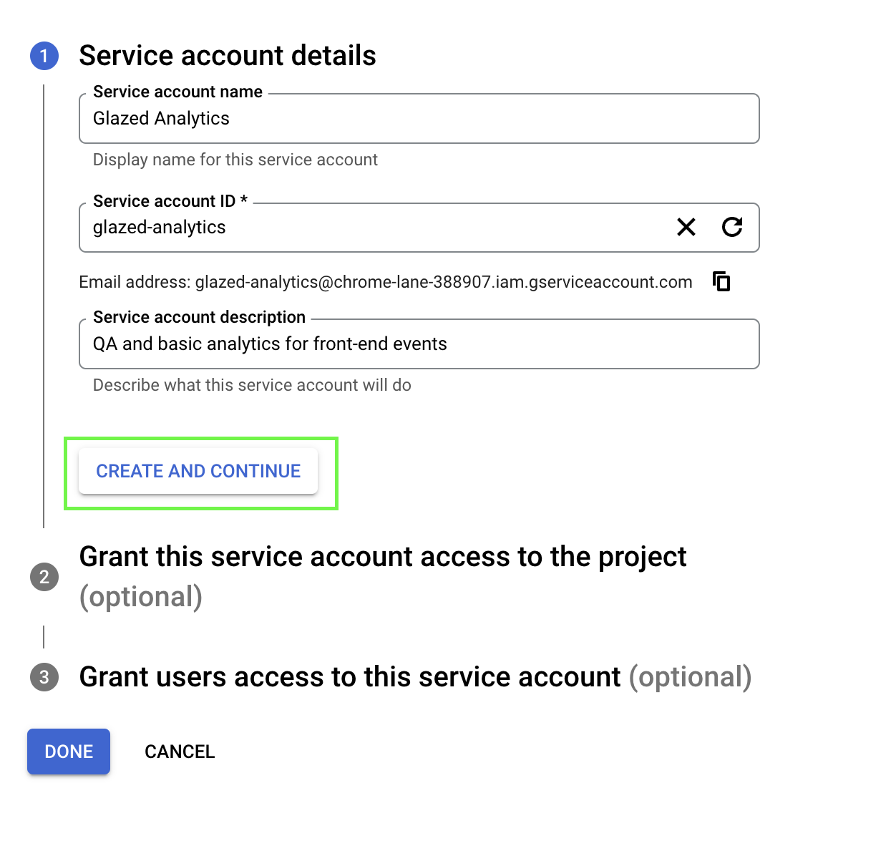
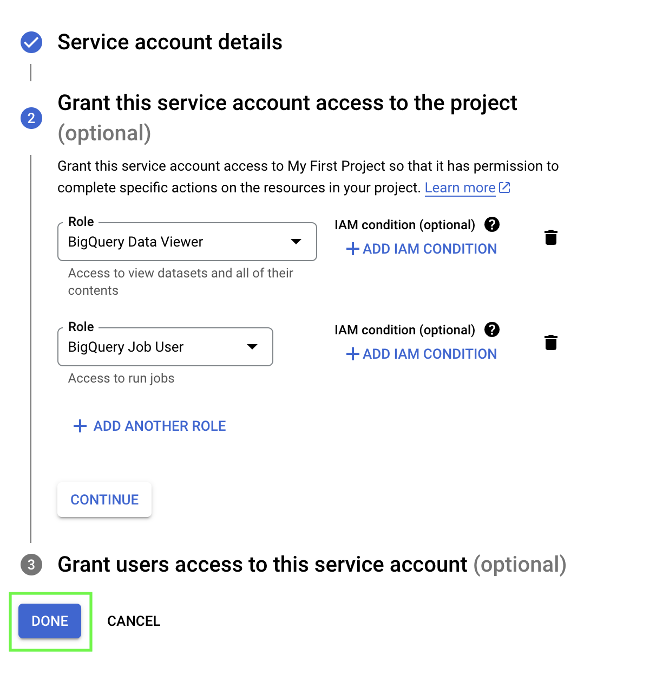
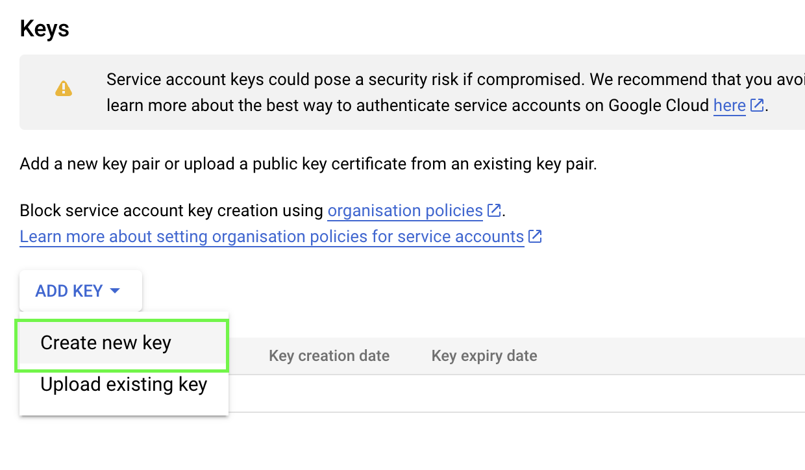

# Connect to Google BigQuery using a Service Account

Connect Glazed to Amazon Redshift to validate your analytics events in real-time.

> A service account enables Glazed to automatically validate that the events you create on the Glazed App are correctly arriving to your data warehouse.
>
> This is a read-only service and we will only store the last timestamp for each event (i.e. “last seen) and the aggregated last 30-day volume (total number of clicks).

## Prerequisites

Before connecting BigQuery to Glazed, ensure you have:

- **Google Cloud Project**: Access to a Google Cloud Console project where your BigQuery data is stored
- **Project Admin Rights**: IAM permissions to create service accounts and assign roles
- **BigQuery Access**: The project must have BigQuery enabled and contain your analytics data
- **Data Location**: Know which datasets and tables contain your event data

## Setup Process

### 1. Create User in BigQuery

1. Open the [Google Cloud Console](https://console.cloud.google.com/) and select your project.
2. Navigate to the "IAM & Admin" section in the left sidebar.

   

3. Click on "[Service Accounts"](https://console.cloud.google.com/iam-admin/serviceaccounts) and then on "Create Service Account".

   

4. Choose a name (e.g. Glazed Analytics) and description for your service account and click on "Create and Continue".

   

5. Under "Role", select "BigQuery" and then "BigQuery Data Viewer" and "BigQuery Job User".
6. Click on "Done".

   

7. Click on the vertical dots on the right of your service account and select "Manage Keys".

   

8. Click on “Add Key” and then “Create new key”.

   

9. Choose "JSON" as the key type and click on "Create".

   

10. Save the JSON file to a secure location on your local machine.

🥳 You have now created a Google BigQuery service account with Data Viewer and Job User roles and downloaded the API key file. After completing the connection process Glazed can use this account to access BigQuery through the API.

### 2. Connect Glazed to Table

Inside a project or design file:

1. Click on the DB icon in the top navigation bar
2. Select your DWH connector
   

3. Add the connection details (from above process)
4. Specify the corresponding schema and column names (Amplitude, Mixpanel, Custom)
   
