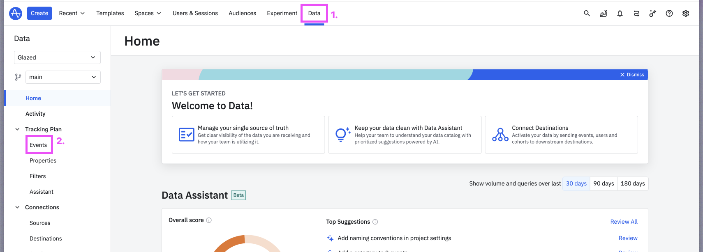
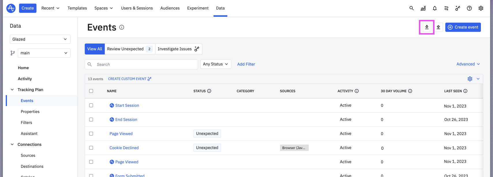
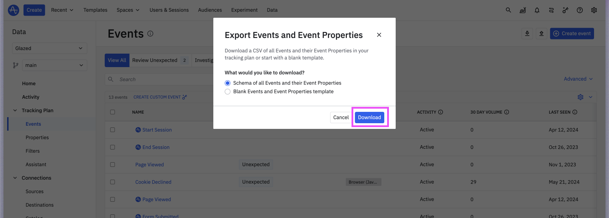

# Export your Schema from Mixpanel

## Steps

1. Open your Amplitude project, click on “Data” and select “Events”
   

\
2. In the events page, click on the ⬇️ button

\
3. Select Type “Schema of all Events and their Event Properties” and click “Download”

\
4. Upload into Glazed via the “Upload Tracking ” modal

