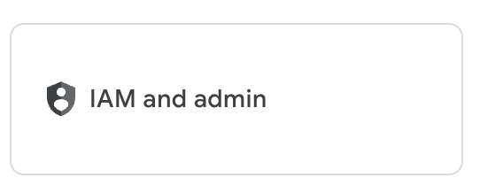
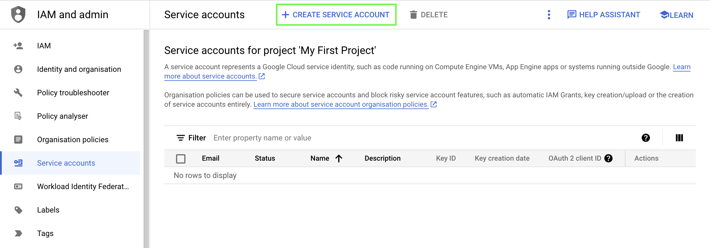
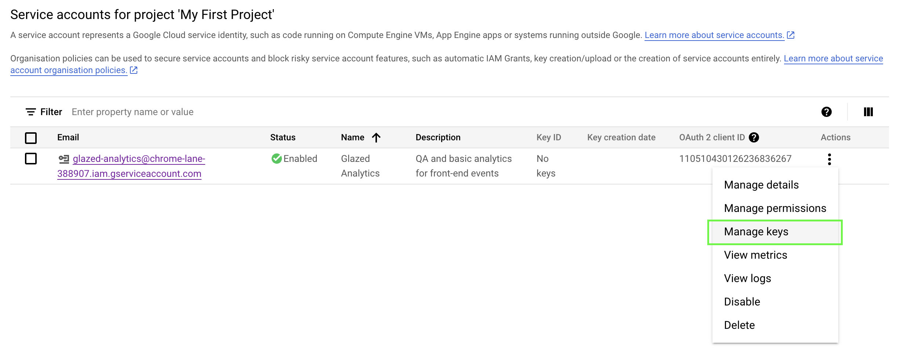
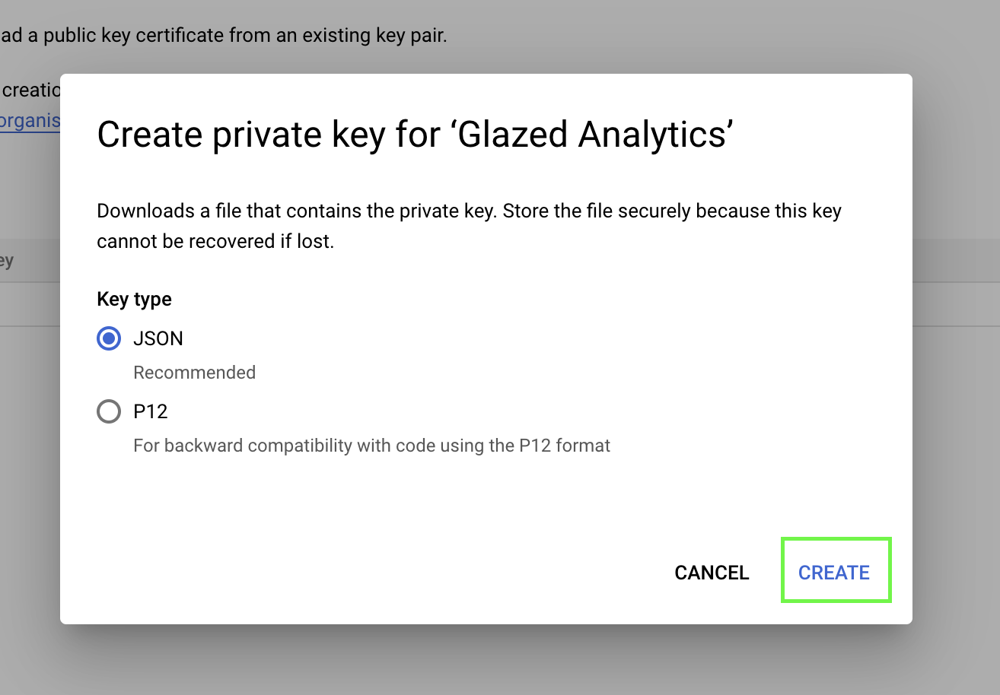
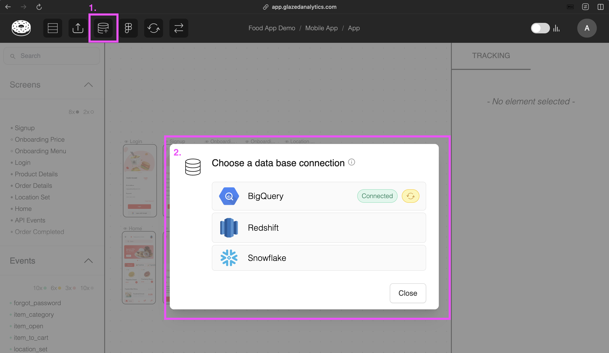

# Connect to Google BigQuery using a Service Account

Connect Glazed to your DWH to validate your analytics events in real-time.

> A service account enables Glazed to automatically validate that the events you create on the Glazed App are correctly arriving to your data warehouse.
>
> This is a read-only service and we will only store the last timestamp for each event (i.e. “last seen") and the aggregated last 30-day volume (total number of clicks).

## BigQuery

> **Prerequisites:**  
> Before connecting BigQuery to Glazed, ensure you have:
>
> - **Google Cloud Project**: Access to a Google Cloud Console project where your BigQuery data is stored
> - **Project Admin Rights**: IAM permissions to create service accounts and assign roles
> - **BigQuery Access**: The project must have BigQuery enabled and contain your analytics data
> - **Data Location**: Know which datasets and tables contain your event data

### 1. Create User in BigQuery

1. Open the [Google Cloud Console](https://console.cloud.google.com/) and select your project.
2. Navigate to the "IAM & Admin" section in the left sidebar.

   

3. Click on "[Service Accounts"](https://console.cloud.google.com/iam-admin/serviceaccounts) and then on "Create Service Account".

   

4. Choose a name (e.g. Glazed Analytics) and description for your service account and click on "Create and Continue".

   

5. Under "Role", select "BigQuery" and then "BigQuery Data Viewer" and "BigQuery Job User".
6. Click on "Done".

   

7. Click on the vertical dots on the right of your service account and select "Manage Keys".

   

8. Click on “Add Key” and then “Create new key”.

   

9. Choose "JSON" as the key type and click on "Create".

   

10. Save the JSON file to a secure location on your local machine.

🥳 You have now created a Google BigQuery service account with Data Viewer and Job User roles and downloaded the API key file. After completing the connection process Glazed can use this account to access BigQuery through the API.

### 2. Connect Glazed to Table

Inside a project or design file:

1. Click on the DB icon in the top navigation bar
2. Select your DWH connector
   

3. Add the connection details (from above process)
4. Specify the corresponding schema and column names (Amplitude, Mixpanel, Custom)
   

## Snowflake

> **Prerequisites:**  
> Before setting up the Snowflake connector, ensure you have:
>
> - **Admin rights** to create Snowflake Roles and Users
> - **ACCOUNTADMIN** or similar role with user management privileges
> - **Access to SQL worksheet** in Snowflake
> - **Events flowing** into Snowflake tables

### 1. Create Glazed User

1. Open new `SQL Worksheet` in Snowflake
2. Edit the below query by adding your corresponding values for:
   - WAREHOUSE_NAME
   - DATABASE_NAME
   - SCHEMA_NAME
   - TABLE_NAME
   - PASSWORD
3. Run the query:

```sql
CREATE ROLE "GLAZED_ANALYTICS";

CREATE USER "GLAZED"
    MUST_CHANGE_PASSWORD = FALSE
    DEFAULT_ROLE = "GLAZED_ANALYTICS"
    PASSWORD = "[PASSWORD]";

GRANT USAGE ON WAREHOUSE "[YOUR WAREHOUSE NAME]" TO ROLE "GLAZED_ANALYTICS";
GRANT USAGE ON DATABASE "[YOUR DATABASE NAME]" TO ROLE "GLAZED_ANALYTICS";
GRANT USAGE ON SCHEMA "[YOUR DATABASE NAME]"."[YOUR SCHEMA NAME]" TO ROLE "GLAZED_ANALYTICS";
GRANT SELECT ON TABLE "[YOUR DATABASE NAME]"."[YOUR SCHEMA NAME]"."[YOUR TABLE NAME]" TO ROLE "GLAZED_ANALYTICS";
GRANT ROLE "GLAZED_ANALYTICS" TO USER "GLAZED";
```

> This query grants the “GLAZED” user permission to run `SELECT` statements **only on the specified table**. You can modify the query to grant access to multiple tables as needed.

### 2. Connect Glazed to table

Inside a project or design file:

1. Click on the DB icon in the top navigation bar
2. Select your DWH connector
   

3. Add the connection details (from above process)
4. Specify the corresponding schema and column names (Amplitude, Mixpanel, Custom)
   

### Snowflake FAQs

#### How do I find my custom values?

- `WAREHOUSE_NAME`
  You can run the query SELECT CURRENT_WAREHOUSE() to see the current warehouse or SHOW WAREHOUSES to preview all warehouses.  
  More info here: https://docs.snowflake.com/en/sql-reference/sql/show-warehouses

- `DATABASE_NAME`, `SCHEMA_NAME`, `TABLE_NAME`
  Tables are usually structured as: database_name.schema_name.table_name.

- `Account Identifier`
  The account identifier has the format <org-name>-<account-name>. You can find it from your dedicated Snowplow login URL, before 'snowflakecomputing.com'

> [!TIP]
> You can also run the query `SELECT CURRENT_ORGANIZATION_NAME(), CURRENT_ACCOUNT_NAME();` to access the Organization and account names directly.  
> More infos here: https://docs.snowflake.com/en/user-guide/admin-account-identifier

## Redshift

> **Prerequisites:**  
> Before setting up the Redshift connector, ensure you have:
>
> - **Admin access** to your Redshift cluster
> - **Publicly accessible cluster** (or VPC configuration for private clusters)
> - **Events flowing** into Redshift tables

### 1. Whitelist Glazed IP Addresses

> In order to be able to read your Redshift tables, you need to whitelist Glazed’s IP addresses in the VPC security group.

1. Navigate to your Redshift cluster.

   

2. Go to the **Properties** tab, and use the link for **VPC security group** under *Network and security settings*.

   

3. Open the ‘Edit inbound rules’ menu

   

4. Add the following rules for every Glazed IP address:

   ```jsx
   3.124.22.25/32
   18.157.59.125/32
   18.192.47.195/32
   ```

   ```
   Type: Custom TCP
   Port range: 5439
   Source: (see IP addresses above)
   Description: Glazed Analytics
   ```

   

5. Click ”Save rules”

### 2. Make Cluster Accessible

> By default, databases are only accessible from within the VPC. To use external services such us Amplitude or Jupyter Notebooks you need to make the cluster publicly accessible. Access is still limited to whitelisted IP addresses only and requires user credentials.

1. Navigate to your Redshift clusters overview

2. Select the cluster > Actions > ‘Modify publicly accessible setting’

   

3. Select ‘Turn on Publicly accessible’ and Save

### 3. Create a Glazed User

> Create a dedicated read-only user for Glazed Analytics. This grants the "glazed" user permission to run `SELECT` statements **only** on the specified tables.

1. Open a new Query Editor in the Console of your Redshift Cluster
2. Run the following queries:

```sql
CREATE USER glazed WITH PASSWORD '<create a password>';

GRANT USAGE ON SCHEMA schema_name TO glazed;

GRANT SELECT ON TABLE schema_name.table_name TO glazed;
```

> You can modify the query to grant access to multiple tables by repeating the `GRANT SELECT` statement for each table.

### 4. Connect Glazed to table

Inside a project or design file:

1. Click on the DB icon in the top navigation bar
2. Select your DWH connector
   

3. Add the connection details (from above process)
4. Specify the corresponding schema and column names (Amplitude, Mixpanel, Custom)
   

### Redshift FAQs

#### How can I find out my host?

1. Go to your cluster in the AWS console
2. Copy the “Endpoint: information and remove everything after the “:” (included)

   

Example of host: [`redshift-cluster-1.cq6rilpu2470.eu-central-1.redshift.amazonaws.com`](http://redshift-cluster-1.cq6rilpu2470.eu-central-1.redshift.amazonaws.com:5439/dev)
