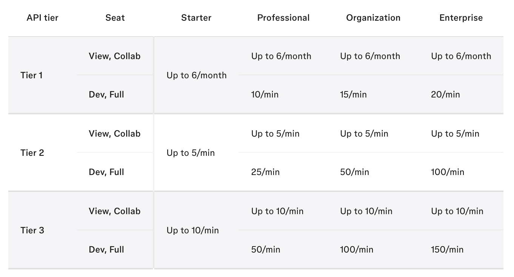

# Figma API

## Overview

Glazed integrates with [Figma](https://www.figma.com/) to import and sync your design files, allowing you to link screens and components to tracking events. This integration uses the [Figma REST API](https://developers.figma.com/docs/rest-api/) and requires proper authentication and adherence to Figma's rate limits.

## How Glazed Uses the Figma API

When you connect Figma to Glazed, the platform uses OAuth authentication to access your Figma files. Glazed stores the OAuth token at the **project level**, meaning the API rate limits are determined by the Figma user who authorized the connection.

The integration allows Glazed to import and sync Figma design pages from your Figma workspace into Glazed, so you can link tracking documentation to specific design components.

## Figma API Rate Limits

Since November 2025, Figma applies [rate limits](https://developers.figma.com/docs/rest-api/rate-limits/) to all REST API requests based on three factors:

## Performance Recommendations

Since Glazed stores the Figma OAuth token at the project level, the rate limits are determined by the Figma user who sets up the connection. **We strongly recommend the following approach for optimal performance:**

### Give a Designer Access to Glazed

1. Use Glazed's [user management dashboard](https://app.glazedanalytics.com/accounts/1/users) to invite a team member who has a **Dev or Full Figma license** (typically a designer)
2. Have that user set up the Figma connection from within Glazed.

> **How to reset Figma OAuth token:**  
> You can manually force a new Figma authentication process by:
>
> 1. Trigger 'Renew Figma access' from your user profile drop-down
> 2. Import a new file
>
>    

This approach provides:

- **Higher rate limits** compared to Viewer/Collaborator seats
- **Faster sync times** for large Figma files
- **Better reliability** when multiple team members are using Glazed

## Best Practices

To optimize your Figma integration and avoid rate limiting:

1. **Use the right seat type**: Connect with a Dev/Full license user for maximum performance
2. **Sync strategically**: Only sync the Figma files you actively need in Glazed
3. **Monitor usage**: If you encounter rate limits, consider the timing of your syncs
4. **Upgrade if needed**: Larger teams on higher Figma plans receive better rate limits

## Troubleshooting

If you're experiencing slow syncs or rate limit issues:

- **Check who set up the connection**: Ensure the Figma connection was authorized by a user with a Dev or Full license
- **Verify your Figma plan**: Higher-tier plans (Professional, Organization, Enterprise) have increased limits
- **Review sync frequency**: Consider spacing out manual syncs if you're hitting rate limits

For more details on Figma's rate limits, see the [official Figma API documentation](https://developers.figma.com/docs/rest-api/rate-limits/).
