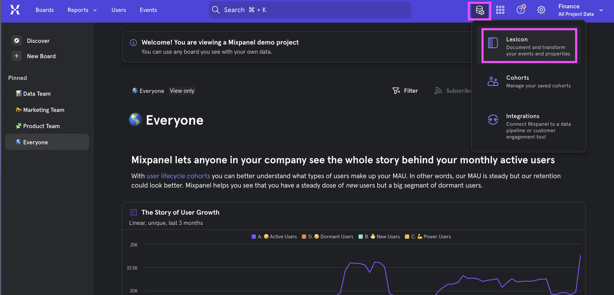
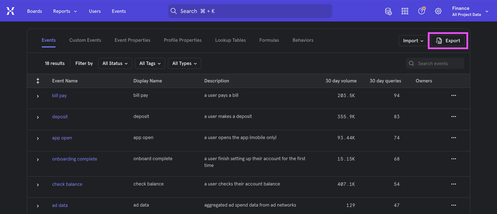
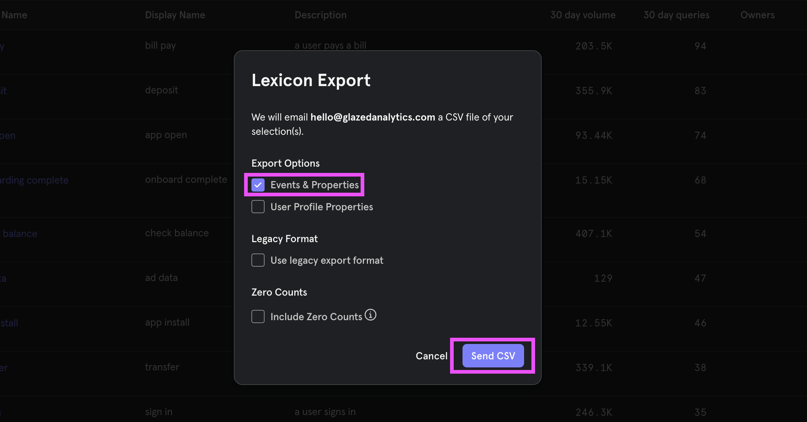
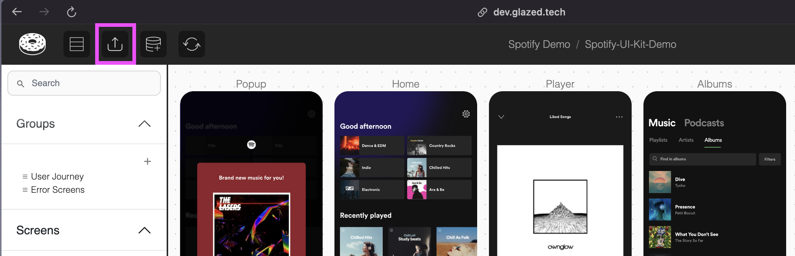

# Export your Schema from Mixpanel

## Steps

1. Open your Mixpanel project, click on “Data Management” and select “Lexicon"

\
2. In the events page, click on “Export”

\
3. Select Type “Events & Properties” and click “Send CSV”

\
4. Check your inbox for the .csv file and upload into Glazed  
 
