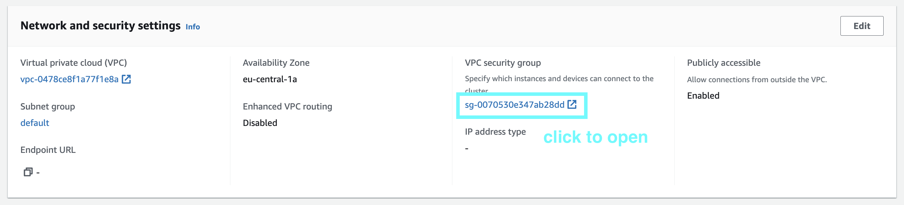
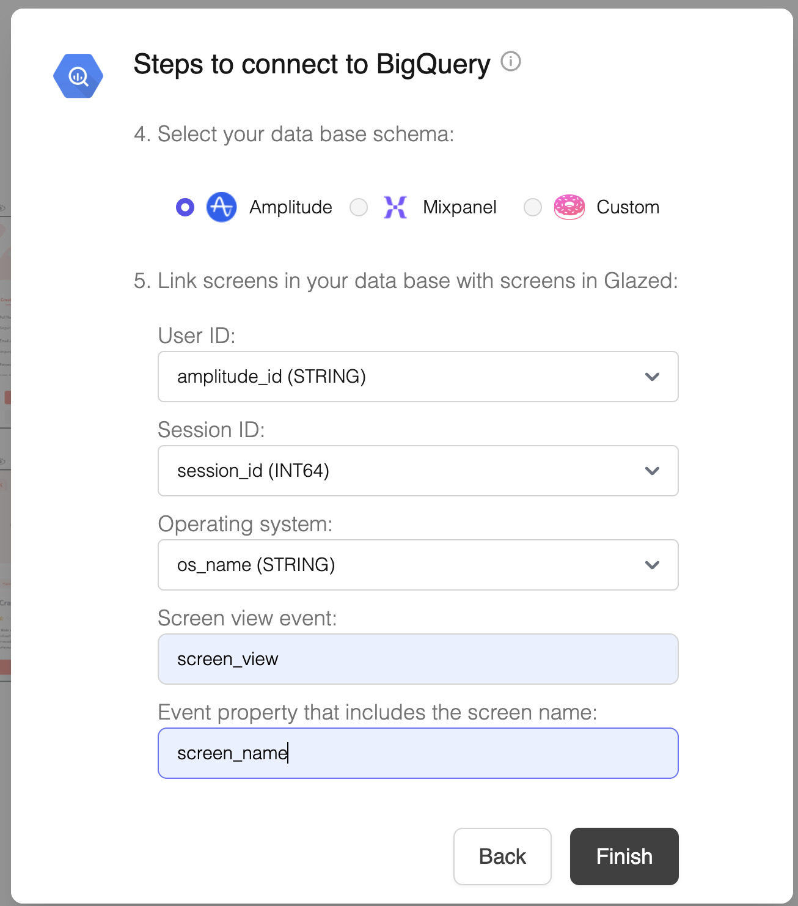
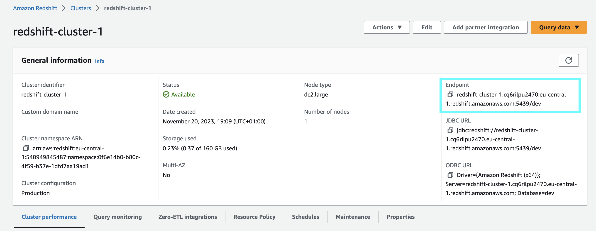

# Redshift Connector

Connect Glazed to Amazon Redshift to validate your analytics events in real-time.

> This connector enables Glazed to automatically validate that the events you create on the Glazed App are correctly arriving to your data warehouse.
>
> This is a read-only service and we will only store the last timestamp for each event (i.e. “last seen) and the aggregated last 30-day volume (total number of clicks).

## Prerequisites

Before setting up the Redshift connector, ensure you have:

- **Admin access** to your Redshift cluster
- **Publicly accessible cluster** (or VPC configuration for private clusters)
- **Events flowing** into Redshift tables

## Setup Process

### 1. Whitelist Glazed IP Addresses

> In order to be able to read your Redshift tables, you need to whitelist Glazed’s IP addresses in the VPC security group.

1. Navigate to your Redshift cluster.

   

2. Go to the **Properties** tab, and use the link for **VPC security group** under *Network and security settings*.

   

3. Open the ‘Edit inbound rules’ menu

   

4. Add the following rules for every Glazed IP address:

   ```jsx
   3.124.22.25/32
   18.157.59.125/32
   18.192.47.195/32
   ```

   ```
   Type: Custom TCP
   Port range: 5439
   Source: (see IP addresses above)
   Description: Glazed Analytics
   ```

   

5. Click ”Save rules”

### 2. Make Cluster Accessible

> By default, databases are only accessible from within the VPC. To use external services such us Amplitude or Jupyter Notebooks you need to make the cluster publicly accessible. Access is still limited to whitelisted IP addresses only and requires user credentials.

1. Navigate to your Redshift clusters overview

2. Select the cluster > Actions > ‘Modify publicly accessible setting’

   

3. Select ‘Turn on Publicly accessible’ and Save

### 3. Create a Glazed User

> Create a dedicated read-only user for Glazed Analytics. This grants the "glazed" user permission to run `SELECT` statements **only** on the specified tables.

1. Open a new Query Editor in the Console of your Redshift Cluster
2. Run the following queries:

```sql
CREATE USER glazed WITH PASSWORD '<create a password>';

GRANT USAGE ON SCHEMA schema_name TO glazed;

GRANT SELECT ON TABLE schema_name.table_name TO glazed;
```

> You can modify the query to grant access to multiple tables by repeating the `GRANT SELECT` statement for each table.

### 4. Connect Glazed to table

Inside a project or design file:

1. Click on the DB icon in the top navigation bar
2. Select your DWH connector
   

3. Add the connection details (from above process)
4. Specify the corresponding schema and column names (Amplitude, Mixpanel, Custom)
   

## FAQs

### How can I find out my host?

1. Go to your cluster in the AWS console
2. Copy the “Endpoint: information and remove everything after the “:” (included)

   

Example of host: [`redshift-cluster-1.cq6rilpu2470.eu-central-1.redshift.amazonaws.com`](http://redshift-cluster-1.cq6rilpu2470.eu-central-1.redshift.amazonaws.com:5439/dev)
