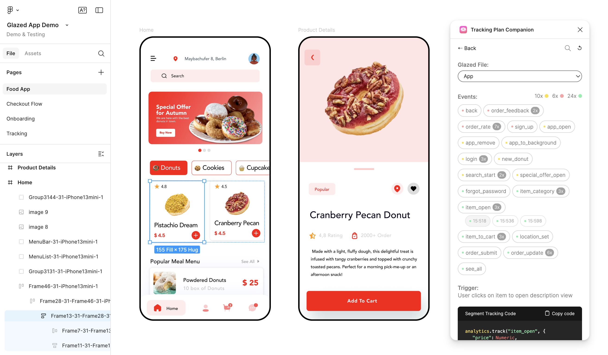
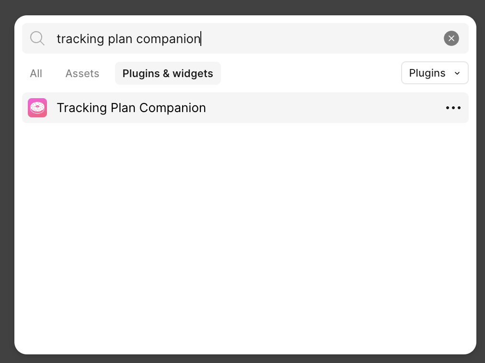
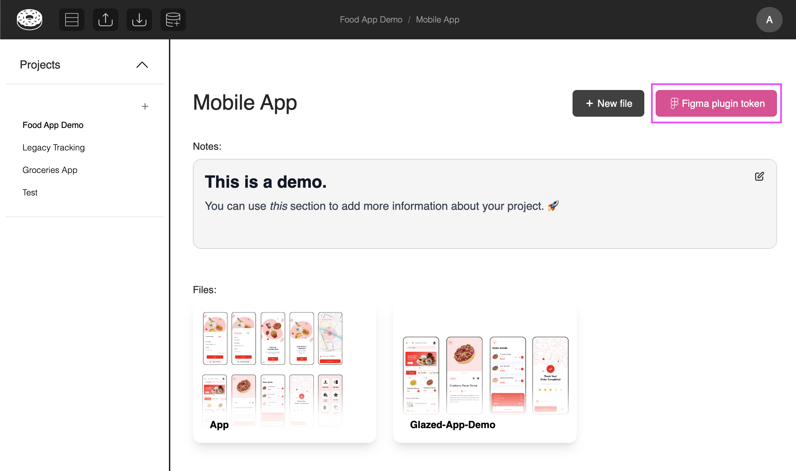
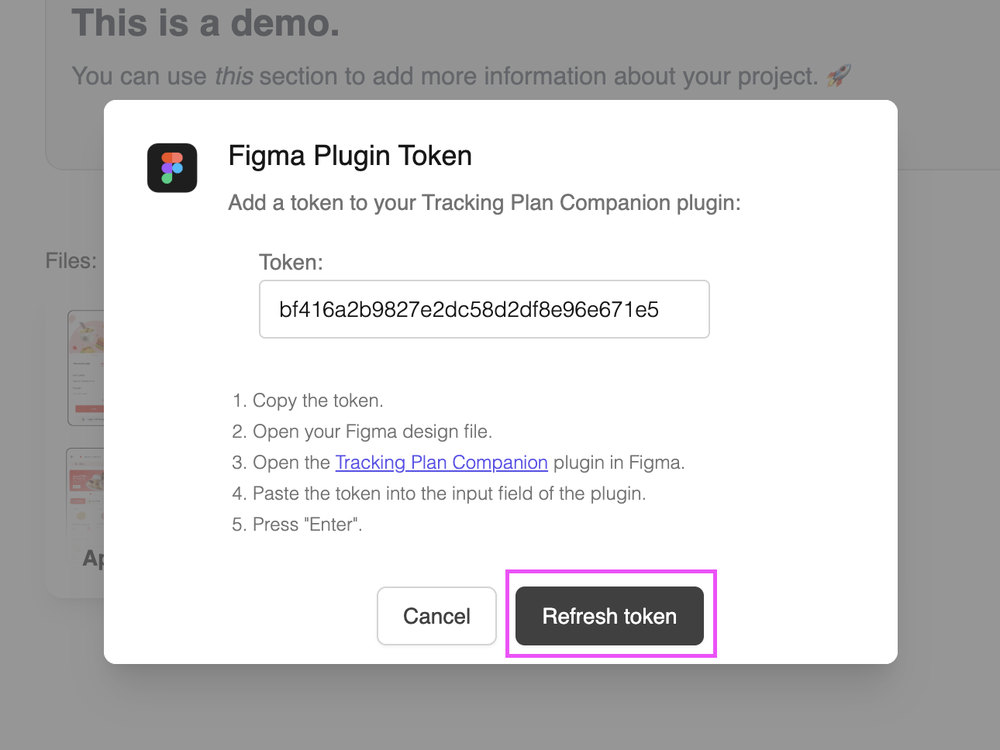

# Glazed Tracking Companion Plugin for Figma

Access your event documentation from Figma screens without ever leaving the Figma canvas.  
Check out the official [Figma Community page](https://www.figma.com/community/plugin/1349786461796635832/tracking-plan-companion)

> **Prerequisites:**
>
> - **Glazed account** with a project set up
> - **Figma file imported** into your Glazed project
> - **Events linked** to design elements (done in Glazed web app)

## Plugin Installation

### In Figma

1. In the **Figma canvas**, right click > Plugins > Manage plugins
2. **Search for "Tracking Plan Companion"**
3. Click on it to **launch the plugin** in your current file
   

### Community URL

Install the plugin directly from the [Figma Community](https://www.figma.com/community/plugin/1349786461796635832)

## Start the Plugin

You will need a Figma Token to login. If you have Edit or View access to Glazed, you can find the token in the project > 'Figma plugin token'

If you don't have access to Glazed, ask someone with access to share the token with you.  
\

## Refresh Figma Token

Editors can trigger a token refresh at any given time. Note that you will have to share the new token with your team in order for them to use the plugin.

> [!TIP]
> Note that tokens exist on a project-level.

## Plugin Features

### Visual Event Discovery

- **Click an event name** to open it's specifications and zoom into it
- **Grouped events** - Click on a grouped event to expand it's children.
- **Click a design element** in the canvas to open it's specifications (if any)
- **Event status badges** help focus on what needs attention

### Filtering Options

- **Filter events in screen** by selecting the screen/frame name in the Figma canvas
- **Filter by status** via the coloured status in the plugin
- **Filter events by name** using the search bar in the plugin

### Other Features

- Multi-Page Navigation
- Figma Dev Mode Compatible
- Hit 'refresh' icon to fetch the latest tracking plan version

## Contributing

Help us improve the plugin:

- **Share feedback** via the [Figma Community](https://www.figma.com/community/plugin/1349786461796635832) on your experience using the plugin
- **Report bugs** through our [Slack](https://join.slack.com/t/glazedanalytics/shared_invite/zt-27kt7tl3n-lkfs1mzqCzyVSKdkiQx2sA) and support channels
- **Suggest features** that would improve your workflow
