# Link Events to Design Elements

Connect your imported events to specific design elements and components in your Figma files to create a visual tracking plan.

> **Prerequisites**
> Before linking events, ensure you have:
>
> - **Figma file imported** into your Glazed project
> - **Tracking schema imported** (optional - you can create events on the fly)

## Linking Events to Design Components

### 1. Select a Design Element

1. Open an imported Figma file in Glazed
2. Click on any design element you want to link to an event (button, card, text link, etc.)
3. Glazed will highlight selectable element in purple

### 2. Link with an Event

There are three different ways to link events to design components:

#### A. Link to an existing event

This event must exist in your project, by either having previously been imported via csv or has been created in the same or another file in the same project.

1. Select a design element
2. Start typing an existing event and click it OR drag&drop it from the left navbar.

> [!TIP]
> You can use the 'Find similar elements" to automatically search for similar looking design components.

> [!TIP]
> Use `shift + click` to select/deselect additional design elements you want to assign an event to

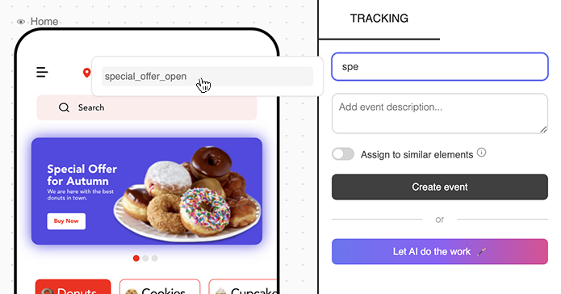

#### B. Link to AI recommendations

> Our AI will give recommendations for key elements in the entire screen/frame

1. Select a design element in
2. Click 'Let AI do the work'
3. Review recommendations and edit / create as desired
   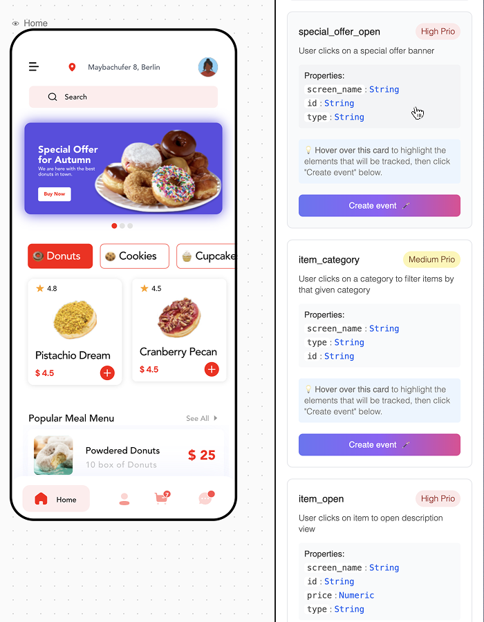

#### C. Create a completely new event

> New events will be added to your project schema automatically.

1. Select a design element
2. Add a new event name and description
3. Click 'Create event'

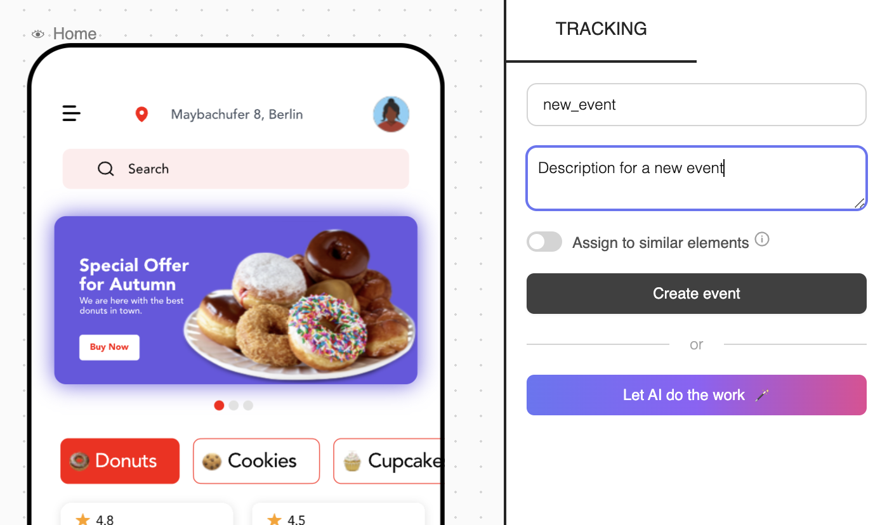

## Event Status

Event status are manually set and defined on element-level only. You can however perform a **bulk action** to overwrite the status of all instances simultaneously by assigning a status on event-level.

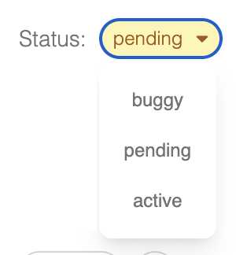

### Event Status on Left Navbar

For simplicity, the left navigation bar displays only one status state per event. The 'worst state' across all instances in the present file is prioritized.

> [!TIP]
> Click on the `x7` on the right of an event to expand all it's children elements and see the individual status.
> 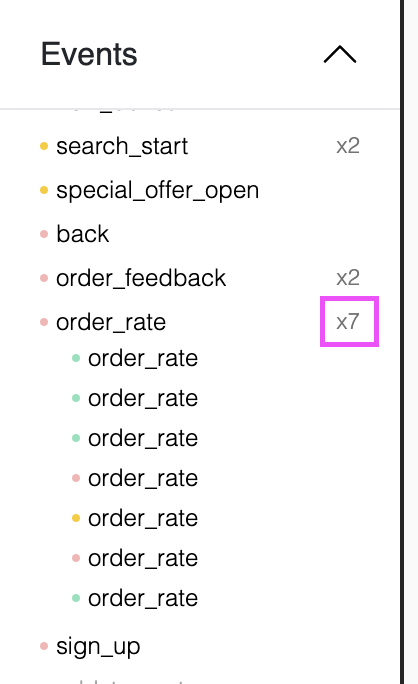

## Filter Events in Canvas

### Filter Events in Canvas by Status

A great way to get a quick overview of events is to use the status filters. Simply click on any of the 4 status in the left navigation bar to display their corresponding linked elements.

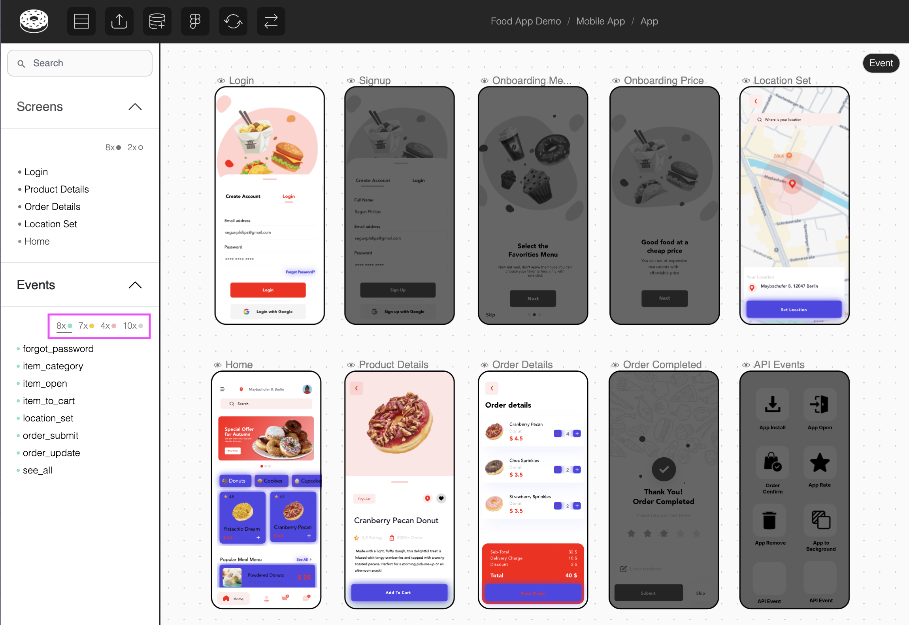

### Filter Events in Canvas by Screen

Often you only want to see the events related to a particular screen/frame. You can do that in three different ways:

1. Select a screen name via the Left Navbar
2. Click on the screen name in the canvas
   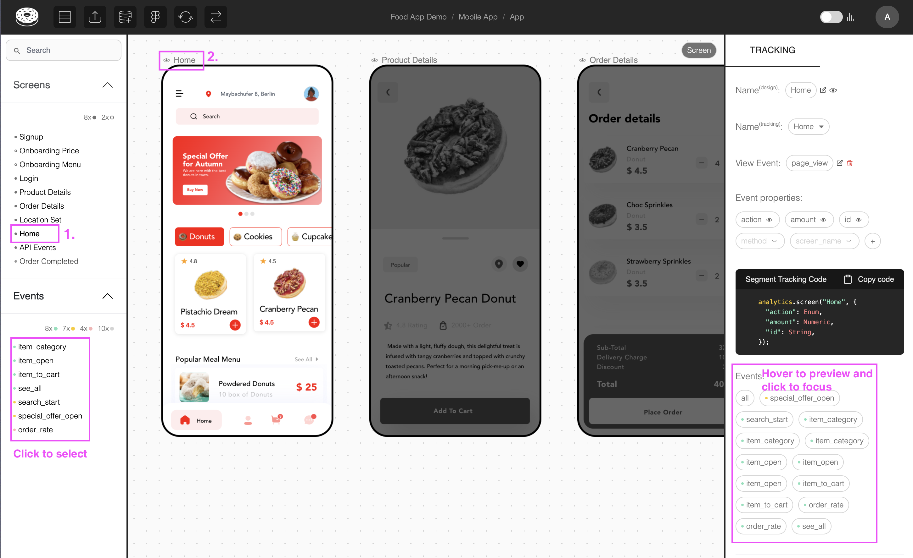
3. Select and event and click on the screen name via the right navbar
   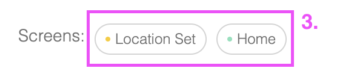

## Display Event in Canvas

You can display all events in the canvas via the _profile > Show events in canvas_ toggle.

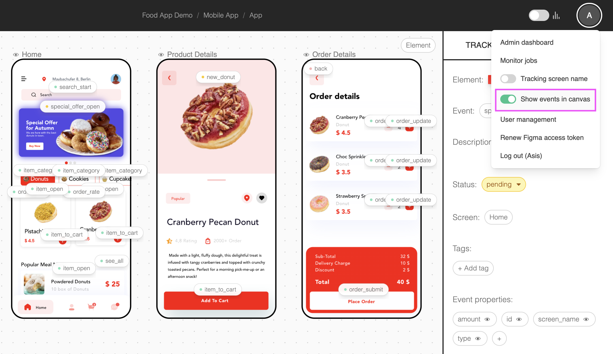

## Unlink Events

To unlink an event from a design element:

1. Select the linked element
2. Click "Unlink Event" icon in the right navigation bar
3. Confirm the removal
   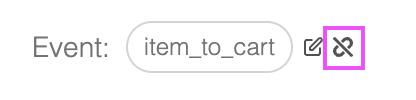

## Delete Events

To completely remove an event from your project:

1. Navigate to the Table View (on Project level)
2. Find the event to delete
3. Click on the bin icon
4. Confirm - this will remove all instances of the event

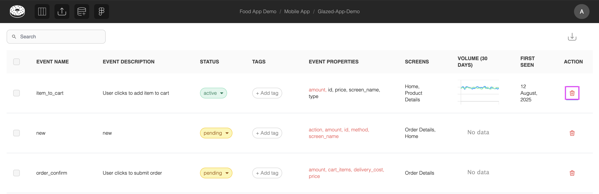

> [!TIP]
> Select multiple events to use **bulk delete**

<!-- ## Video Tutorial

  <iframe src="https://www.youtube.com/embed/rNZR3MsLF2Y" frameborder="0" allow="accelerometer; autoplay; clipboard-write; encrypted-media; gyroscope; picture-in-picture" allowfullscreen style="position: absolute; top: 0; left: 0; width: 100%; height: 100%;"></iframe>

 -->

### Next Steps

After linking events to your design, proceed to [Create Event Properties and User Properties](getting-started/event-properties.md) to define the data structure for your tracking implementation.
