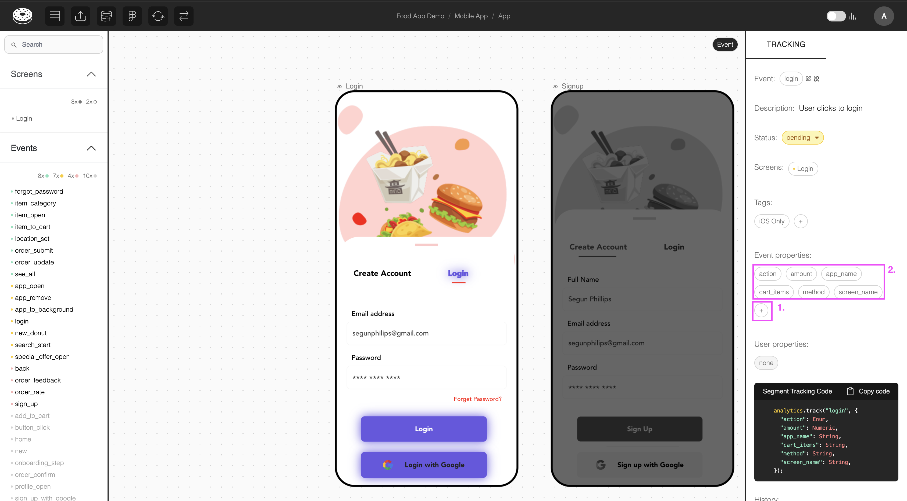
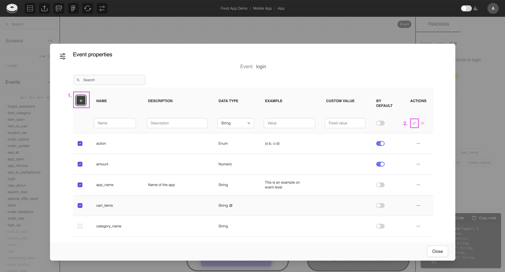
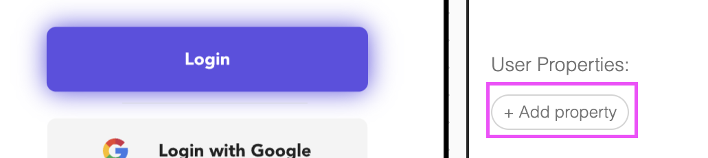
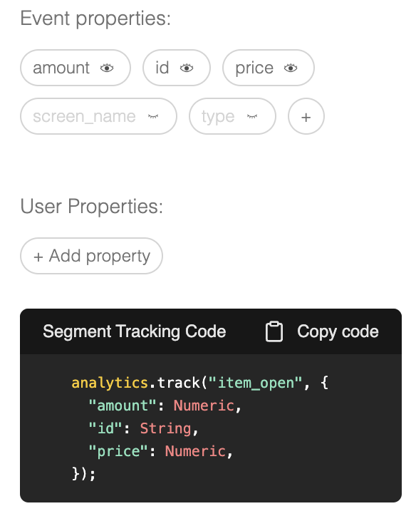

# Create and Assign Event and User Properties

Define the data structure for your events by creating properties that will be tracked with each user interaction.

## Overview

Properties are the key-value pairs that provide context and detail for your events. There are two main types:

- **Event Properties**: Data specific to a particular event instance
- **User Properties**: Attributes that describe the user performing the event

## Event Properties

### Creating Event Properties

1. Inside a Glazed file, select an event and click on the '+' icon
2. Click "+" in the Event Properties modal to create new properties
   
   > [!TIP]
   > Hover over or click a single property to view/edit that property modal.
3. Define the property details:
   - **Name**: Clear, descriptive identifier
   - **Description**: Context for when/how this property is used
   - **Data Type**: String, Integer, Float, Boolean, Date, etc.
   - **Example**: An example to help with the implementation (optional)
   - **Custom Value**: If you want to assign a custom value (optional)
   - **By Default**: Whether this property must always be added when creating new events
     

### Common Event Properties

#### E-commerce Events

- `product_id`: Unique identifier for products
- `product_category`: Category classification
- `price`: Product or transaction value
- `quantity`: Number of items
- `discount_applied`: Whether a discount was used

#### Navigation Events

- `page_name`: Current page identifier
- `section`: Area of the application
- `previous_page`: Where the user came from
- `navigation_method`: How they navigated (menu, search, direct)

#### Form Events

- `form_name`: Identifier for the form
- `field_name`: Specific field being interacted with
- `form_step`: For multi-step forms
- `validation_errors`: Any errors encountered

## User Properties

### Creating User Properties

1. Select a design component
2. Click 'Add Property' in the 'User Property' section
   
3. Define the property (same as normal properties)
   > User properties con only be assigned to elements. While on event-level, you can hvoer over the user property to display it's location in the canvas.

### Common User Properties

#### Identity Properties

- `user_id`: Unique user identifier
- `account_type`: Free, premium, enterprise, etc.
- `signup_date`: When they joined
- `first_purchase`: Date of users first login
- `subscription_tier`: Service level

#### Behavioral Properties

- `total_purchases`: Lifetime purchase count
- `last_active_date`: Most recent activity
- `feature_flags`: Enabled features or experiments
- `preferred_language`: Language setting

## Property Assignment

### Assigning to Events

1. Select an event from your schema
2. open the properties modal > choose relevant properties
3. Set default values where appropriate
4. Add Examples to help others understand expected values
5. Set property to **As Default** for it to be automatically assigned when creating new events in Glazed.

### Assigning to Elements

When linking events to design elements:

1. Select the design element with an associated event
2. Configure element-specific property values via the property modal
3. Override defaults where necessary

### Hide Properties Across Elements

You can hide properties form specific elements (i.e. instances of an event) by clicking the 'eye' icon. This will only affect the selected property.

> [!TIP]
> Hidden properties will not be displayed in the pseudocode for improved communication in developer handoff.

## Best Practices

### Naming Conventions

- We recommend using **snake_case** formatting (e.g., `user_id`, `product_name`)
- **Be descriptive**: Clear what the property represents
- **Avoid abbreviations**: Unless they're industry standard
- Make properties **reusable**: eg. use a single property 'type' instead of two separate properties 'product_type' and 'user_type'

## Next Steps

With your properties defined, you're ready to:

- Export your tracking specification for development
- Begin implementation in your application
- Set up monitoring and QA monitoring
- Create dashboards and analysis based on your schema

Your Glazed project now contains a complete, visual tracking plan that bridges design and analytics!
