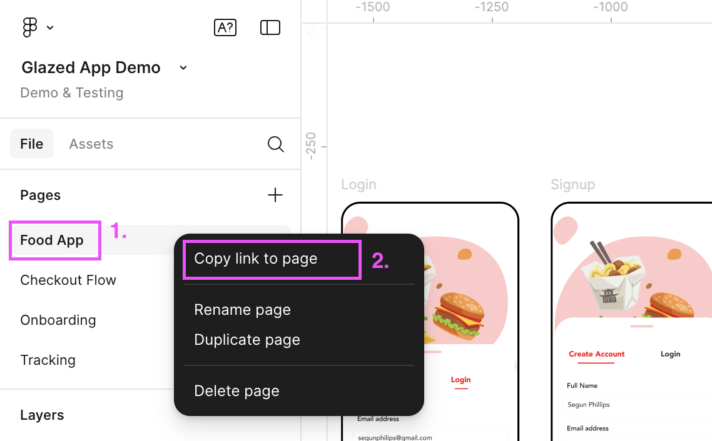
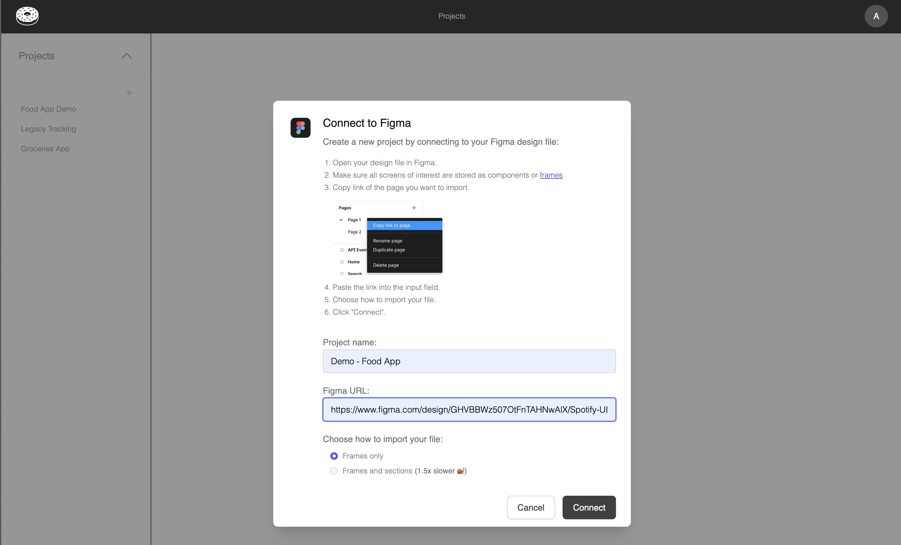
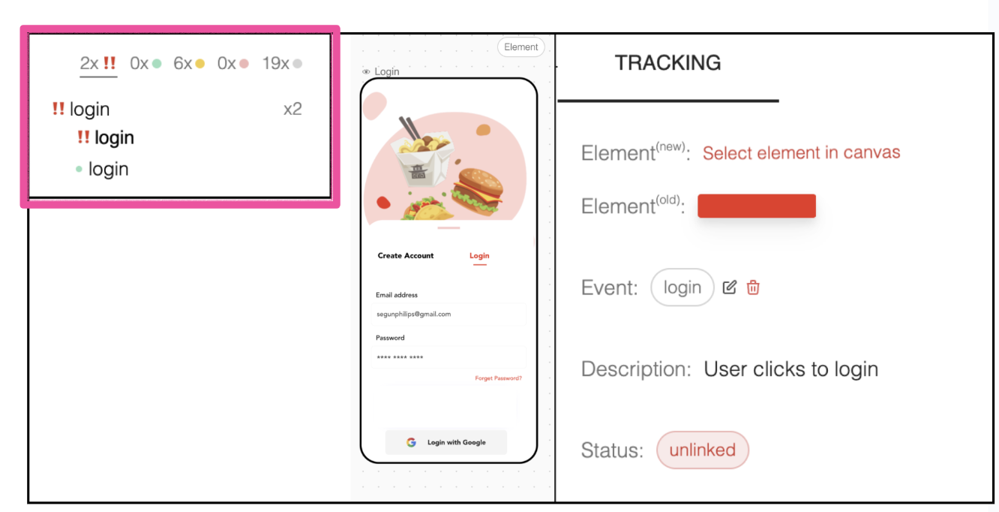

# Import Figma Files into Glazed

Learn how to connect your Figma design files to Glazed to begin visually mapping your analytics events.

> **Prerequisites**
> Before importing your Figma files, ensure you have:
>
> - At least **view access** to the Figma file you want to import
> - **Share settings configured** - Enable "Viewers can copy, save, and export" in your Figma file's share settings

## Import Figma Page

1. Log into your Glazed account
2. Click "Create New Project"
3. Give your project a descriptive name
4. In Figma, copy the Figma page link
   
5. Paste the link into Glazed
6. Click "Connect"

## Sync Figma Page

You can trigger a Sync job to fetch the latest version of the Figma design file. This is a background job, so you can work on other files while the sync takes place.

### Broken or missing Design Components

In the case of a design component that was linked to an event goes missing after a Sync, it will be set to status 'action required' until it's either re-assigned to a new design component or removed.

> You can sync multiple times without loosing 'action required' events.

### Re-linking broken events after sync

1. Select the event that needs to be re-linked
2. Unnest all it's children (if applicable)
3. Click on a new element to re-link the broken event
4. Confirm the re-linking process
   

## Performance Guidelines

Check out our [Figma Best Practices](https://www.figma.com/design/UlDIqelNaa5eBrB3zPEaQo/Food-App-Demo--Public-?node-id=2320-21&t=vPoGHMgyAkduqFpq-1) for more insights on how to best work with Figma and Glazed.

- **Large files**: Files with 300+ screens may reduce performance
- **Optimize images** in Figma to speed up import process
- Consider breaking large files into smaller, focused imports
  > [!TIP]
  > Some teams create a dedicated **Tracking page** in Figma where only screens needed for tracking are added. This helps avoid unwanted changes and improves performance.

### Alternative Import Method

For websites that need to be tracked, you can use the [html.to.design Figma plugin](https://html.to.design/) to import websites directly into Figma, then import them into Glazed.

### Common Issues

- **Access denied**: Ensure you have read access to the Figma file
- **Import fails**: Check that share settings allow copying and exporting
- **Missing screens**: Verify you're copying the correct project/page URL

## Video Tutorial

  <iframe src="https://www.youtube.com/embed/TgKeJQa3CwQ" frameborder="0" allow="accelerometer; autoplay; clipboard-write; encrypted-media; gyroscope; picture-in-picture" allowfullscreen style="position: absolute; top: 0; left: 0; width: 100%; height: 100%;"></iframe>

### Next Steps

Once your Figma file is imported, you can proceed to [Import Tracking Schema](getting-started/import-tracking-schema) to connect your analytics events.
