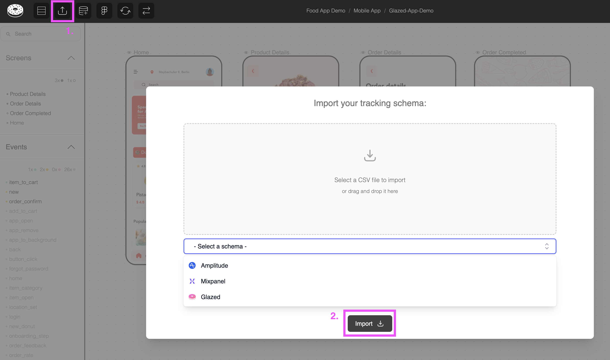

# Import and Export Your Tracking Schemas

Connect your existing analytics events to Glazed by importing your tracking schema from platforms like Mixpanel or Amplitude.

> **Prerequisites**
>
> - **Access to your analytics project** (Mixpanel, Amplitude, or similar)
> - Your existing event tracking schema or event definitions

## Download Schema

### From Mixpanel

> See [Export Mixpanel Schema](../external-connectors/mixpanel-schema.md) for more detailed documentation.

1. Navigate to your Mixpanel project
2. Go to Data Management > Events
3. Export your event schema/definitions

### From Amplitude

> See [Export Amplitude Schema](../external-connectors/amplitude-schema.md) for more detailed documentation.

1. Access your Amplitude project
2. Go to Data > Events
3. Download your event schema

### Custom Schema / Glazed Schema

If you have a tracking schema in a Google Spreadsheet or similar, you can simply rename the columns to match our [Glazed Schema](https://docs.google.com/spreadsheets/d/1953wD00tGMWIuJkCpWb1vN8EbzBtXeBPRJyZjdvkT4Q/edit?usp=sharing) and import it.

1. **Rename columns** to match the expected column names from our [Template](https://docs.google.com/spreadsheets/d/1953wD00tGMWIuJkCpWb1vN8EbzBtXeBPRJyZjdvkT4Q/edit?usp=sharing)
2. Download schema as **.csv**
3. In Glazed: **Upload Tracking** > Select **Glazed** > Import your CSV

> [!TIP]
> You can import a single column `event_name` using the Glazed schema to get started and update it later via another import.

## Upload to Glazed

1. In your Glazed project or file, click on "Import Schema"
2. Choose your csv file
3. Confirm the import
   

<!-- ## Video Tutorial

  <iframe src="https://www.youtube.com/embed/UG74Urf3Seg" frameborder="0" allow="accelerometer; autoplay; clipboard-write; encrypted-media; gyroscope; picture-in-picture" allowfullscreen style="position: absolute; top: 0; left: 0; width: 100%; height: 100%;"></iframe>

 -->

### Next Steps

With your schema imported, you can now [Link Events to Design Elements](create-and-link-events.md) to start mapping your tracking implementation.
