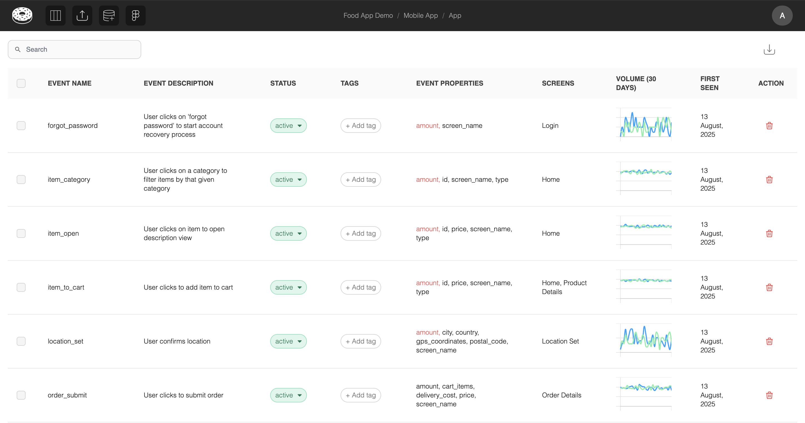

# Data Warehouse Monitoring

Our QA feature is designed to help teams monitor events and properties arriving in their data warehouse in real-time.

> **Prerequisites:**
>
> - An active DWH connection - see [DWH Connectors](../external-connectors/dwh-connector.md) for guides.
> - A Figma page imported into Glazed with events assigned to it

## Table View

After a successful DWH connection to a table that contains events matching those in the Glazed file, you will see the following:

- Last **30 days volume** (split by platform)
- **First seen** (firt time an event was seen in that table)
- **Missing properties** for a given event (coloured red)
  \
  

> [!TIP]
> You can hover-over the volume or an event property to see more details:
> 
