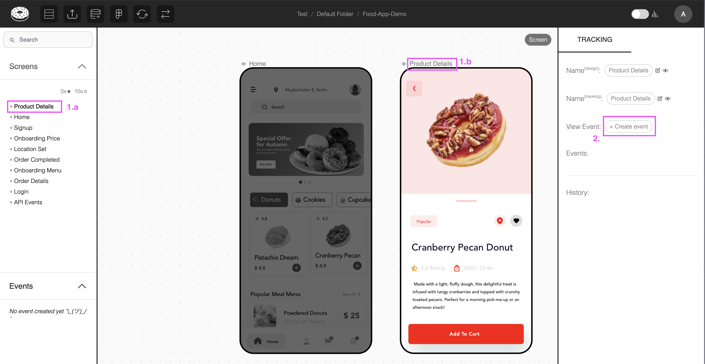
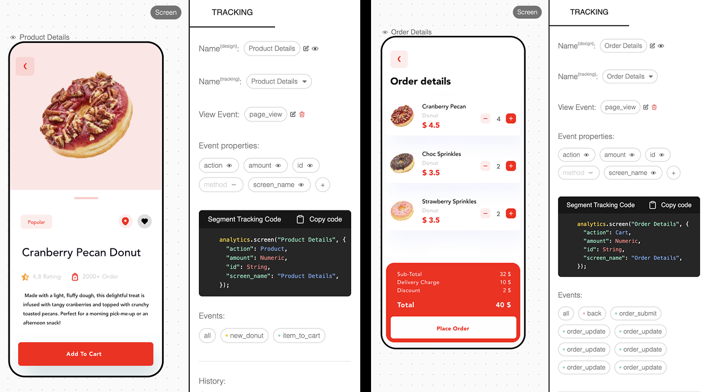
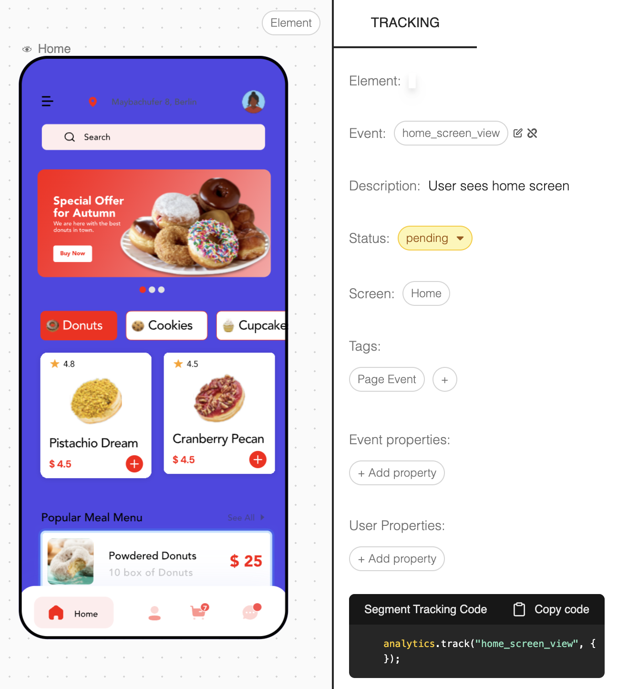

# Screen View & Page View Events

Glazed has a dedicate event for page and screen views (eg.`page_view`). Similarly to event / element levels, the event has a class that can be customized for every screen by 'hiding' properties and/or adding custom values.

## Screen-related Events

You can create a dedicated screen event by:

1. Enter a screen via the left navbar OR by clicking the screen name in the canvas
2. In the right navbar, click on '+ Create event'
3. Add your screen/page view event name and confirm
   \
    

After a screen/page event has been created, you can add/edit properties in the class level and customize each instance's payload individually.

> **Example**  
> Both screens have the same payload inherited by the `page_view` event class, but each has been customized to display different properties and custom values for some of the properties.  
> \
> 

## FAQ's

### What if I don't have a dedicated `page_view` event?

We strongly recommend you implement one, as it will make your and your team's lives significantly easier (i.e handle a single event instead of hundreds).

Having said that, you can in the meantime assign events to the background elements in a screen and use a custom tag `page event` to communicate to your team that it is a screen event.

> 

### Can we have different view events in the same project?

For best practices and consistency, you can only have a single view event per project (i.e. per tracking plan / name space).
