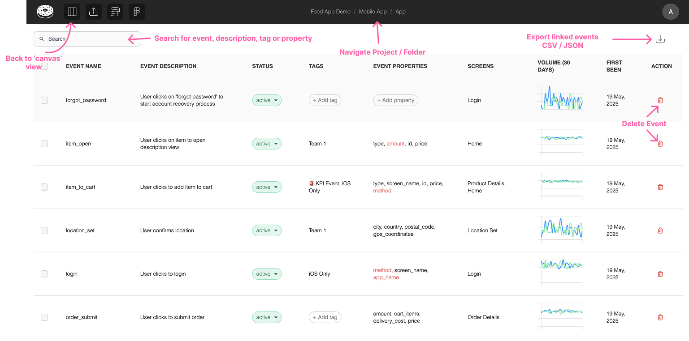
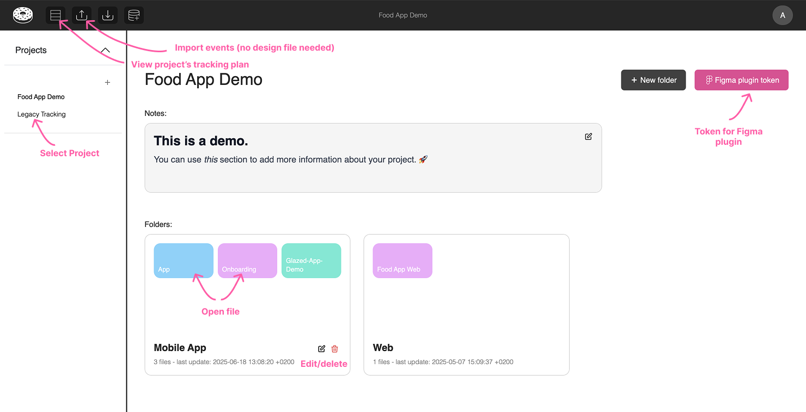

# Cheat Sheet

An overview of all the actions you can trigger across our main workspaces.

## **Canvas**

### Glazed canvas with events:

### Create new event in canvas:

### Inside property modal:

## **Table View**

## **Project View**

