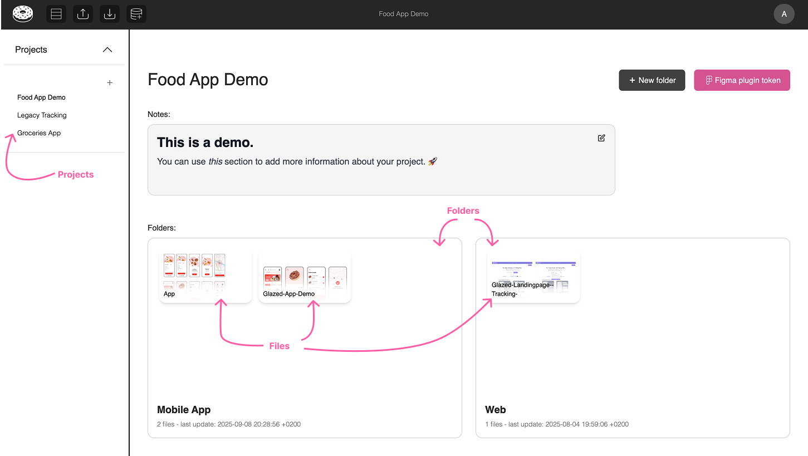

# Key Concepts to Understand Glazed

There are a few new concepts that you need to understand in order to successfully navigate Glazed:

## Design-to-Tracking Workflow

Glazed links Figma design elements directly to analytics events to visually streamline implementation.

**Example:**  
Clicking on the top ‘Login’ button will open its corresponding tracking documentation:


## Projects vs Files



A **Project** contains an entire tracking plan (i.e. name space), organizeds across multiple Figma design **files**, which usually represent features or user journeys.

### Project vs File Table View

You can enter the **Table View** from either a project or a file. The first will display all events in that project (and the files where those event's are linked to design components), while the second will only display all events used (i.e. linked) in that specific file.

> JSON/CSV tables export matches the table location.

## Events vs Elements

In Glazed, there's an important distinction in the level of granularity that helps speed-up and maintain consistent tracking:

### Event-Level

The single, canonical definition of an event in your tracking schema (a class)

- Contains all properties that should be included with this event
- Acts as the "source of truth" for all instances of this event
- Example: A `login` event with properties `app_name` and `login_method`

### Element-Level

Specific instances where this event is triggered with contextual variations.

- Each UI element uses the same event definition (same event name and properties)
- Property values differ based on context (e.g. different `login_method` values)
- Element-level instances inherit the event definition from the event level by default, but this can be over-written.

  

**Example:**  
The image on the left is on ‘Event level’ (it shows all instances of the `login` event).  
The image on the right is on ‘Element level’, it displays a single instance of the `login` event (the value for the property `method` is hardcoded to `google`).


Both events use the same event definition (class), but with different property values en element level:

```javascript
// User clicks to login via email method
analytics.track("login", {
  app_name: "Glazed App",
  login_method: "Email",
});

// User clicks to login via Google method
analytics.track("login", {
  app_name: "Glazed App",
  login_method: "Google",
});
```

> [!TIP]
> You can add custom values to properties on event and/or element level via select an event/element > property name > custom value > {add a custom value}
