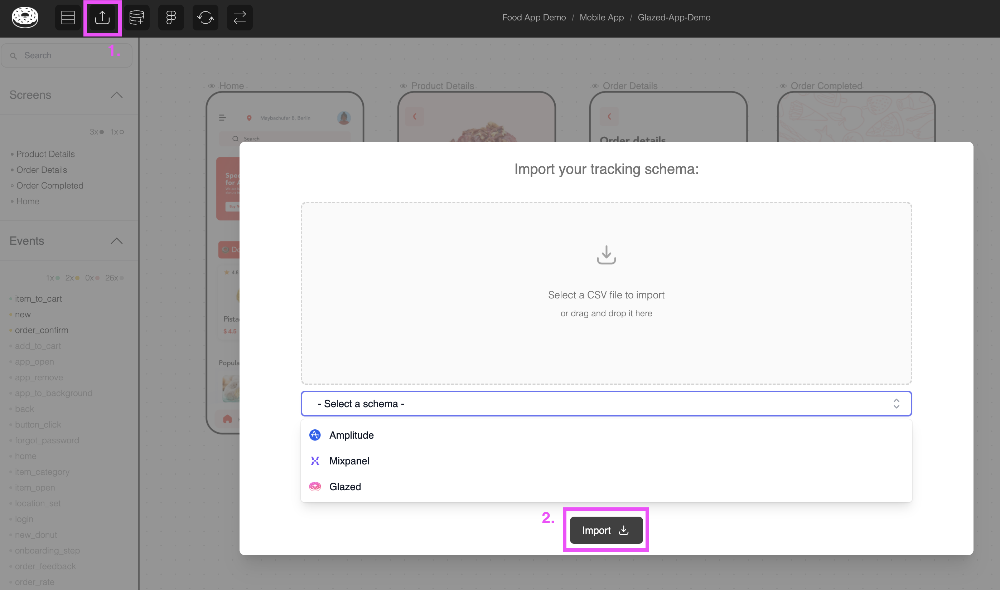
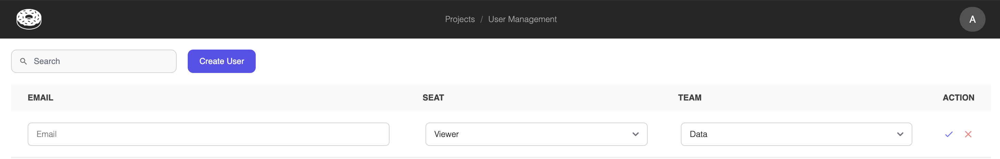

# Quick Start

Import your first Figma design file and create events in less than 5 minutes.

## Prerequisites

Before you begin, make sure you have:

- **Figma account** with a design file you want to use with Glazed
- **Glazed account** (sign up at [glazedanalytics.com](https://glazedanalytics.com))
- **Read access** to the Figma file you want to import
- **Existing events** (optional) to learn from your schema

## Import Figma Design Page

> **💡 Tip**: For best performance, start with Figma pages with fewer than 100 screens.  
> **Having issues?** Check out our [Figma Best Practices Guide](https://www.figma.com/design/UlDIqelNaa5eBrB3zPEaQo/Food-App-Demo--Public-?node-id=2320-21&t=vPoGHMgyAkduqFpq-1)

1. Log into Glazed at [app.glazedanalytics.com](https://app.glazedanalytics.com)
2. Create a new project
3. Authenticate using your Figma account
4. In Figma, copy the link to the Figma page you want to import via `right click + Copy link to page`:
5. Paste the URL in Glazed, give your project a name and hit **Connect**:
   

## Setup Event Schema

### Option A: Start Fresh with AI Suggestions

> **When?** If this is your first tracking plan or if you want to start a new tracking plan from scratch.

1. **Skip the import step** for now
2. Glazed's AI will **suggest relevant events** when you start mapping to design elements
3. **Accept or customize** the AI suggestions based on your needs

### Option B: Import Existing Events

> **When?** If you already have a tracking plan and want to reuse existing events.

**For Mixpanel Users:**

1. In Mixpanel: Go to **Data Management** > **Lexicon**
2. Click **Export** and select "Events & Properties"
3. Click **Send CSV** and check your inbox
4. In Glazed: **Upload Tracking** > Select **Mixpanel** > Import your CSV

**For Amplitude Users:**

1. In Amplitude: Go to **Data** > **Events**
2. Click the **download button (⬇️)**
3. Select **"Schema of all Events and their Event Properties"**
4. In Glazed: **Upload Tracking** > Select **Amplitude** > Import your CSV

**For Custom Schemas:**

If you have a tracking schema in a Google Spreadsheet or similar, you can simply rename the columns to match our [Glazed Schema](https://docs.google.com/spreadsheets/d/1953wD00tGMWIuJkCpWb1vN8EbzBtXeBPRJyZjdvkT4Q/edit?usp=sharing) and import it.

1. **Rename columns** to match the expected column names from our [Template](https://docs.google.com/spreadsheets/d/1953wD00tGMWIuJkCpWb1vN8EbzBtXeBPRJyZjdvkT4Q/edit?usp=sharing)
2. Download schema as **.csv**
3. In Glazed: **Upload Tracking** > Select **Glazed** > Import your CSV

> [!TIP]
> You can import a single column `event_name` using the Glazed schema to get started and update it later via another import.

## Link Events to Design Elements

This is where the magic happens by connecting your tracking documentation to your Figma designs:

1. **Navigate to your imported Figma file** in Glazed
2. **Click on interactive elements** like buttons, forms, and links
3. **Assign events** to each element:  
   a. **Use existing events** from your import, or  
   b. **Create new events** from scratch, or  
   c. **Get AI suggestions** for events in a given screen
   

## Event Properties

You can create/add/remove event properties to events as follows:

1. **Select an event** you want to add/edit/remove properties from
2. In the right navigation bar go to **Event properties > `+` icon**
3. **Create a new property** and/or assign existing properties to the event
   

## Figma Companion Plugin

Once you have some events linked to design components in Glazed, anyone can access them directly from Figma using our Figma Plugin.

1. In Glazed, select a project > "Figma Plugin Token" > copy token
   
2. In Figma, open the [Tracking Plan Companion plugin](https://www.figma.com/community/plugin/1349786461796635832/tracking-plan-companion)
3. Paste the token in the Figma plugin > hit enter
4. Select an event from the plugin to open the tracking specs
   
   > [!TIP]
   > In Figma, you can select a specific frame to filter only the events associated with that particular frame or screen.

## Add More Users to Glazed

If you're an admin, you can create new users and invite them to your Glazed workspace as follows:

1. Click on your user profile
2. Select 'User management'
   
3. Click 'Create User' and add fill in the details
   
4. Hit enter and trigger a password reset so the new user can login

## Common Issues

### Figma Import Problems

**Issue**: "Cannot access Figma file"  
**Solution**: Ensure you have read access and enable "Viewers can copy, save, and export" in share settings

**Issue**: "Import is breaking"  
**Solution**: try optimizing images and complex structures before importing will significantly improve the process.  
Checkout our [Figma Best Practices Guide](https://www.figma.com/design/UlDIqelNaa5eBrB3zPEaQo/Food-App-Demo--Public-?node-id=2320-21&t=vPoGHMgyAkduqFpq-1) to ensure a smooth import.

**Issue**: "Performance lag in Glazed canvas"  
**Solution**: Our canvas is currently not as powerful as Figma's, but you can improve performance by:
a. Create a new Figma page with only the screens you need
b. Hide unwanted screens in Glazed (click on the `eye` icon to hide a screen)

### Event Import Problems

**Issue**: "No events were imported"  
**Solution**: If you're using a custom import, make sure the column names match those from our [schema](https://docs.google.com/spreadsheets/d/1953wD00tGMWIuJkCpWb1vN8EbzBtXeBPRJyZjdvkT4Q/edit?usp=sharing).

### AI Suggestions

**Issue**: "AI didn't suggest events using the right taxonomy"  
**Solution**: Try importing or manually creating 5+ events so the model can learn from your existing taxonomy

## Next Steps

### Expand Your Tracking

- **Link more events** with your Figma designs
- **Add custom values** to event properties
- **Create event tags** for better organization
- **Share the Figma token** with your dev team for tracking instrumentation
- **Sync your Figma files** to stay in sync the design changes
- **Automate your QA** by connecting to Bigquery, Redshift or Snowflake

### Learn More

- Check out our [Key Concepts](quick-start/key-concepts) page for a better experience using Glazed.
- Continue with our comprehensive [Getting Started guides](../getting-started/import-figma-files.md).
- Review our [Cheat Sheets](quick-start/cheat-sheets) navigate Glazed like a pro.

## Get Help

- **Join our [Slack community](https://join.slack.com/t/glazedanalytics/shared_invite/zt-27kt7tl3n-lkfs1mzqCzyVSKdkiQx2sA)** for quick questions
- **Email [hello@glazedanalytics.com](mailto:hello@glazedanalytics.com)** for technical support
- **Check the detailed guides** in this documentation for specific topics
