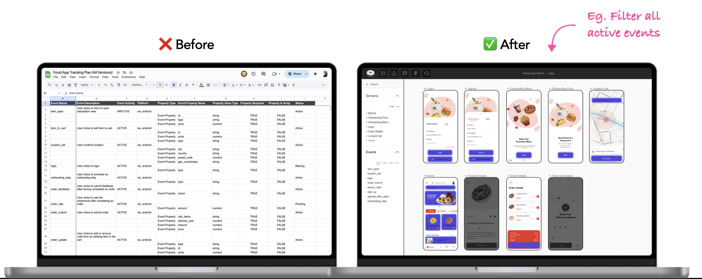
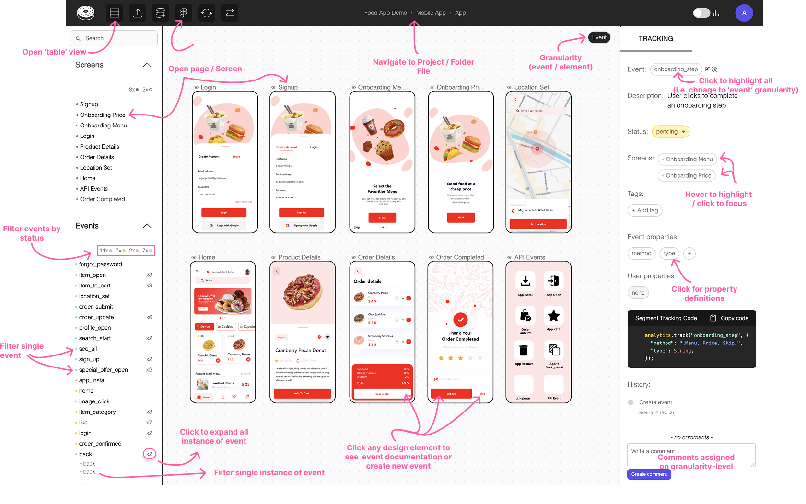
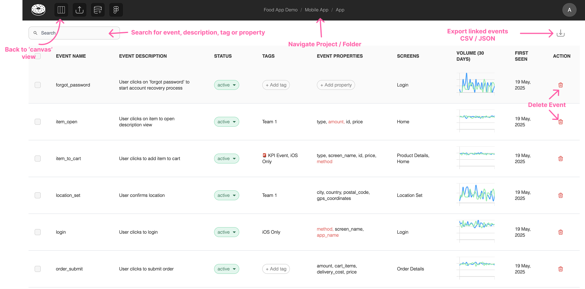

# Quick Start Guide for Glazed Viewers

If you're a developer or only looking to find event names, this is the right guide for you.

## Say Goodby to Spreadsheets

Glazed replaces tracking spreadsheets with a visual-first Figma-integrated process that sits on top of your existing workflow.

### Canvas View

Like Figma but for tracking documentation. Here is our Canvas Cheat Sheet for an overview of the different navigation actions:

**Key Canvas Actions:**

- **Filter events in screen only** by selecting the name of the screen
- **Filter events by status** by clicking a status on the left navbar
- **Display children of event** by clicking on `x2` on left navbar
- **Swap between events and screens** by clicking on their name in the right navbar.
- **Open page/screen view event** by clicking on frame name in canvas or via the left navbar
- **Display all events in canvas** via user profile > show events in canvas

### Table View

Sometime a table is exactly what you need. Here is our Table View Cheat Sheet for an overview of the different navigation actions:

> Note that the table view differs across projects and files. See [Key Concepts](quick-start/key-concepts.md) to learn more.

## Figma plugin

1. Open the plugin in Figma via the plugins menu and searching for “Tracking Plan Companion”
2. Copy the Figma Token from your Glazed Project > Figma plugin token

Learn more about our [Figma Plugin](figma-plugin/)

### Next Steps

- Checkout our [Key Concepts](quick-start/key-concepts) page for a better experience using Glazed.
- Review our [Cheat Sheets](quick-start/cheat-sheets) to navigate Glazed like a pro.
